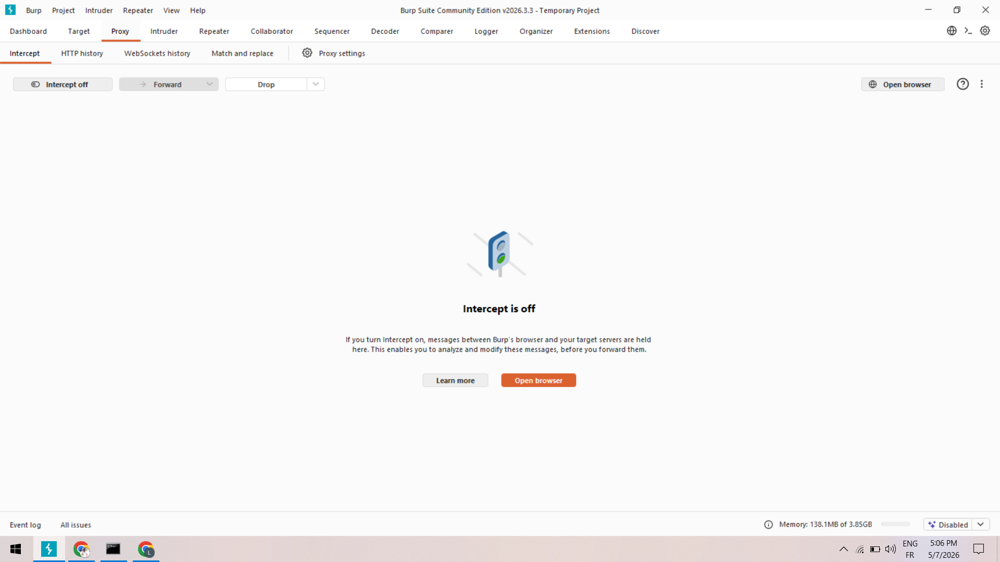
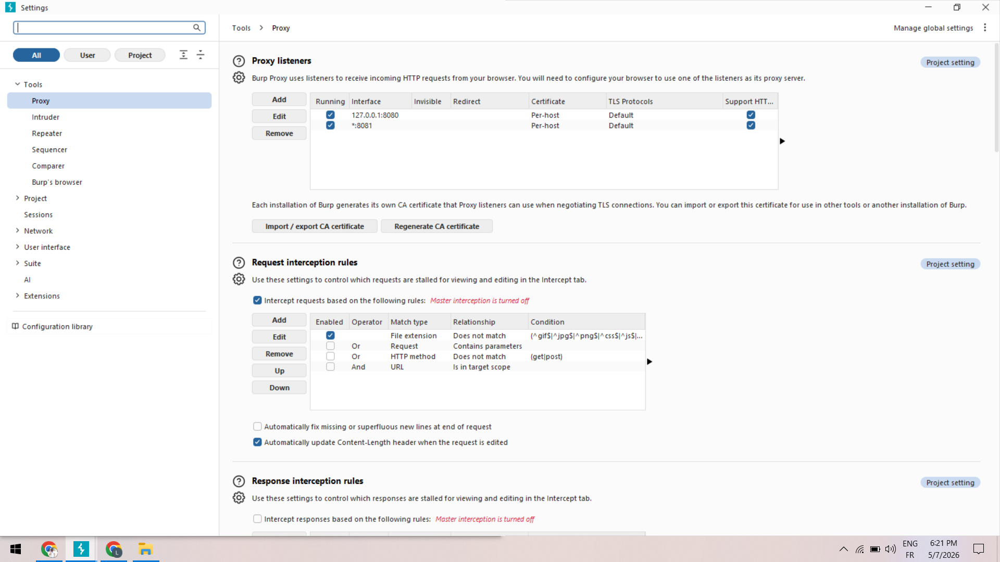
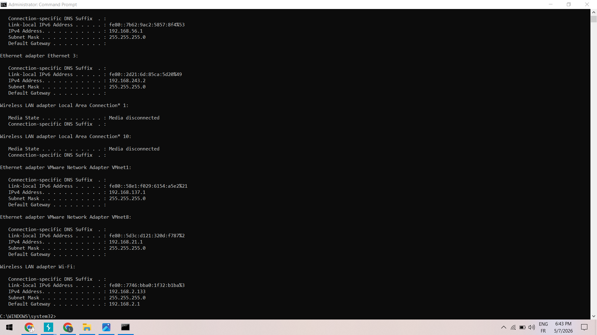
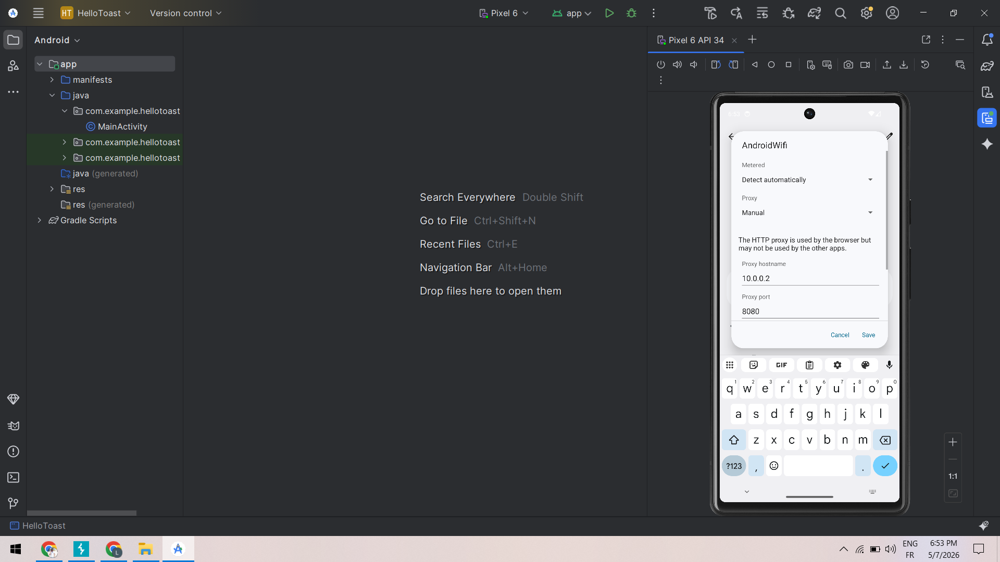
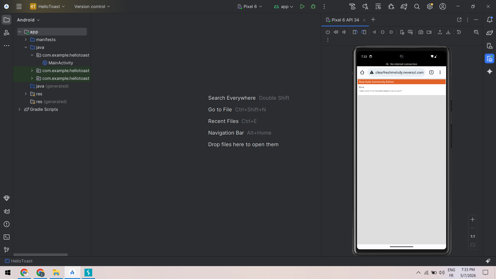
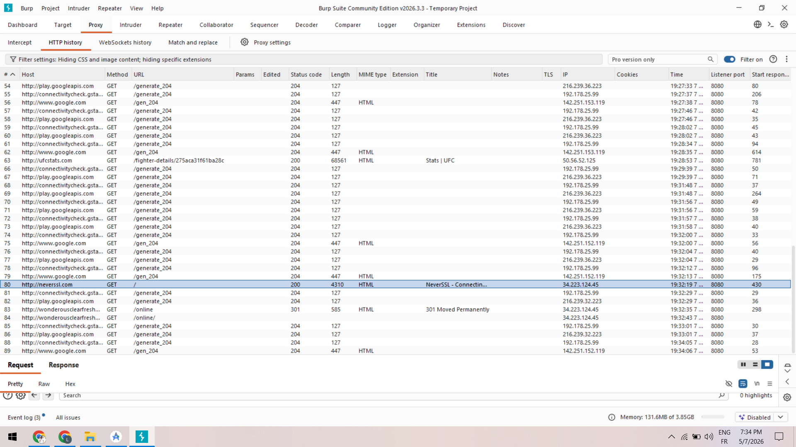
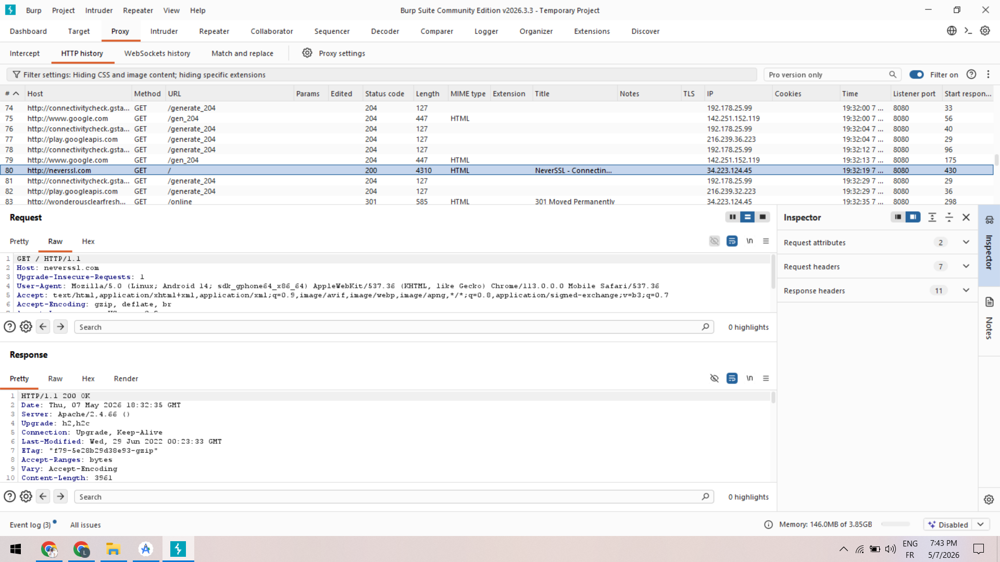
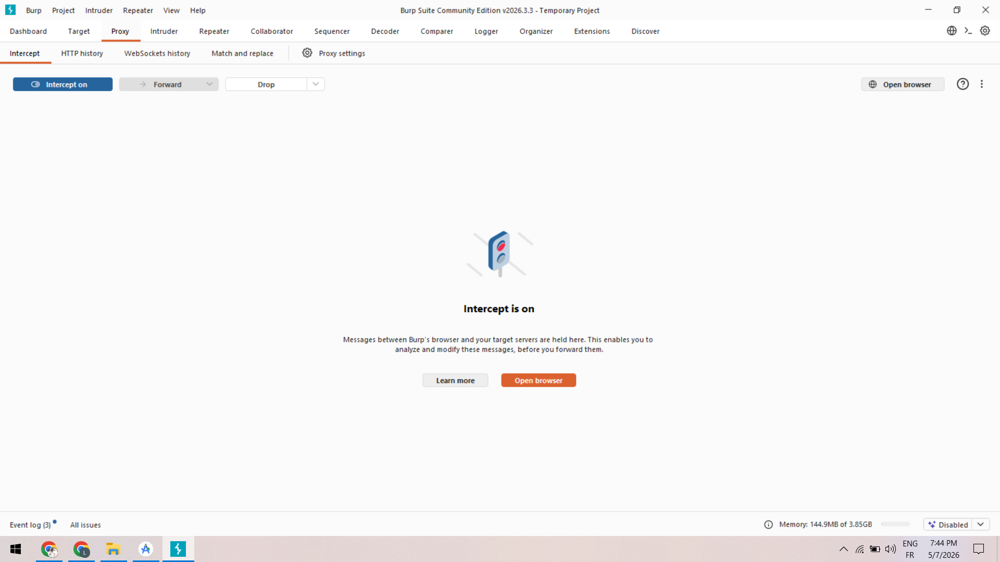
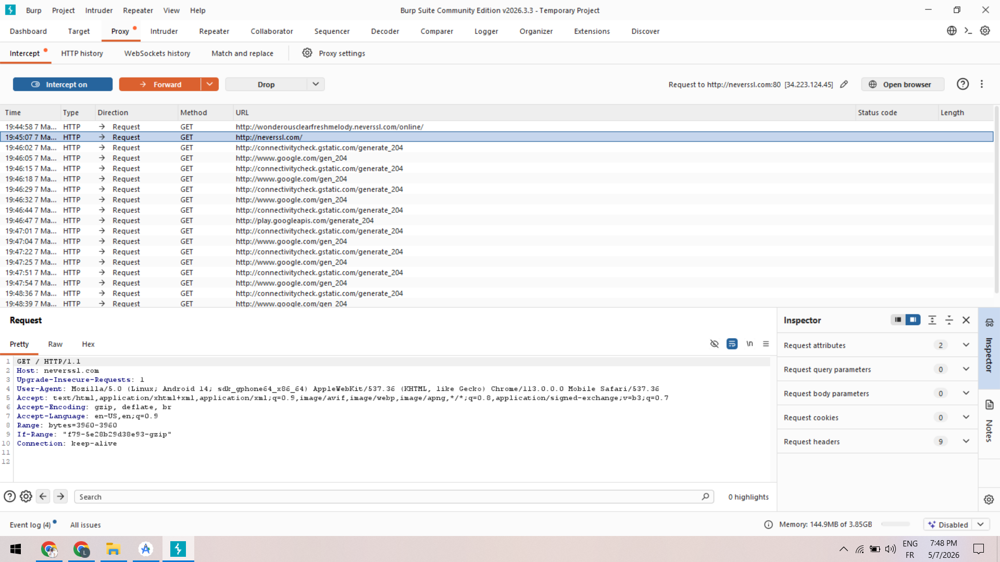

# Lab — Configuration et Observation du trafic HTTP avec Burp Suite et Android Emulator

## Présentation

Ce laboratoire a pour objectif de découvrir le fonctionnement de Burp Suite en mode Proxy dans un environnement Android Emulator.  
Le but principal est de comprendre comment un proxy intercepte et observe les requêtes HTTP émises par un navigateur Android.

Le laboratoire reste volontairement pédagogique et défensif :
- aucune modification agressive des requêtes ;
- aucune exploitation ;
- uniquement de l’observation et de la validation du routage réseau.

L’environnement utilisé :
- Windows 10
- Android Studio Emulator (Pixel 6 API 34)
- Burp Suite Community Edition
- Google Chrome Android
- Android Emulator configuré avec un proxy manuel

---

# Objectifs pédagogiques

À la fin de ce laboratoire, il devient possible de :

- Comprendre le rôle d’un proxy HTTP.
- Configurer Burp Suite comme point de passage du trafic.
- Identifier le listener proxy et son port.
- Configurer un Android Emulator pour utiliser un proxy manuel.
- Observer les requêtes HTTP dans Burp Suite.
- Comprendre la différence entre :
  - capture passive (`HTTP history`)
  - interception active (`Intercept`)
- Valider une chaîne complète :
  
```text
Android Emulator → Burp Suite → Internet
```

---

# Architecture du laboratoire

```text
+-------------------+
| Android Emulator  |
| Chrome Browser    |
+---------+---------+
          |
          | Proxy HTTP
          v
+-------------------+
| Burp Suite Proxy  |
| Port : 8080       |
+---------+---------+
          |
          v
+-------------------+
| Internet / Cible  |
| neverssl.com      |
| ufcstats.com      |
+-------------------+
```

---

# Étape 1 — Préparation de Burp Suite

Burp Suite a été lancé avec un projet temporaire de laboratoire.

L’onglet :
- `Proxy`
- puis `Intercept`

a été vérifié afin de confirmer que :

```text
Intercept is off
```

était bien actif au démarrage.

Cette configuration évite de bloquer immédiatement le trafic réseau.

## Capture



---

# Étape 2 — Vérification du Proxy Listener

Les paramètres du proxy ont ensuite été vérifiés dans :

```text
Proxy settings
```

Un listener actif a été identifié :

- Adresse :
  
```text
127.0.0.1
```

- Port :
  
```text
8080
```

Le listener était bien en état :

```text
Running
```

## Capture



---

# Étape 3 — Identification de l’adresse IP de la machine hôte

La commande suivante a été exécutée sous Windows :

```cmd
ipconfig
```

L’adresse IPv4 principale identifiée sur le réseau Wi-Fi actif était :

```text
192.168.2.133
```

Cette étape permet de comprendre comment identifier la machine hôte sur le réseau local.

## Capture



---

# Étape 4 — Configuration du proxy dans Android Emulator

Le proxy manuel a été configuré dans les paramètres Wi-Fi de l’émulateur Android.

Configuration utilisée :

| Paramètre | Valeur |
|---|---|
| Proxy hostname | `10.0.2.2` |
| Proxy port | `8080` |

L’adresse `10.0.2.2` correspond à l’adresse spéciale permettant à Android Emulator d’atteindre la machine hôte.

## Capture



---

# Étape 5 — Premier test de capture HTTP

Un premier test HTTP a été effectué avec :

```text
http://neverssl.com
```

et également :

```text
http://ufcstats.com
```

Le trafic a correctement été capturé dans :

```text
Proxy → HTTP history
```

Les éléments observés :
- méthode HTTP ;
- URL ;
- code de statut ;
- taille des réponses ;
- headers HTTP.

## Capture



---

# Observation du trafic UFCStats

Une requête HTTP vers :

```text
ufcstats.com
```

a été capturée avec succès.

Burp Suite affichait :
- le host ;
- le chemin ;
- le statut HTTP 200 ;
- la réponse HTML.

## Capture



---

# Analyse Request / Response

Les sections :
- Request
- Response

ont permis d’observer :
- les headers envoyés par Chrome Android ;
- les headers renvoyés par le serveur ;
- les informations réseau HTTP.

## Capture



---

# Étape 7 — Interception contrôlée

Le mode :

```text
Intercept on
```

a été activé temporairement afin de démontrer le fonctionnement actif du proxy.

Une requête HTTP vers :

```text
neverssl.com
```

a été bloquée volontairement dans Burp Suite avant d’être transférée avec :

```text
Forward
```

Cette étape permet de comprendre le principe :

```text
Proxy = point de passage
```

## Capture



---

# Retour au mode passif

Après validation du fonctionnement de l’interception, Burp Suite a été remis en mode :

```text
Intercept off
```

afin de restaurer une navigation normale dans l’émulateur.

## Capture



---

# Résultats obtenus

Le laboratoire a permis de :

- Configurer Burp Suite comme proxy HTTP.
- Configurer Android Emulator pour utiliser le proxy.
- Observer le trafic HTTP dans Burp Suite.
- Intercepter temporairement des requêtes.
- Comprendre la différence entre capture passive et interception active.

La chaîne complète de communication a été validée avec succès :

```text
Android Emulator → Burp Suite → Internet
```

---

# Conclusion

Ce laboratoire constitue une première approche pratique de l’analyse réseau HTTP avec Burp Suite.

Même sans manipulation avancée des requêtes, il permet de comprendre :
- le fonctionnement d’un proxy ;
- le routage du trafic ;
- la structure des requêtes et réponses HTTP ;
- le principe d’interception contrôlée.

Ce type de laboratoire est essentiel avant d’aborder :
- HTTPS ;
- certificats CA ;
- analyse mobile avancée ;
- sécurité applicative Android.
